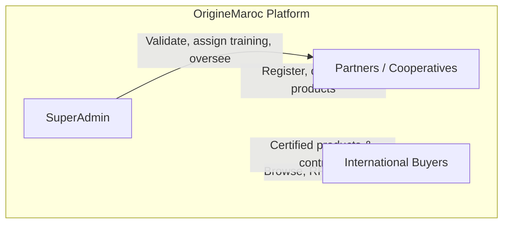
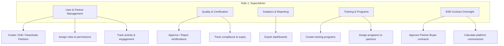
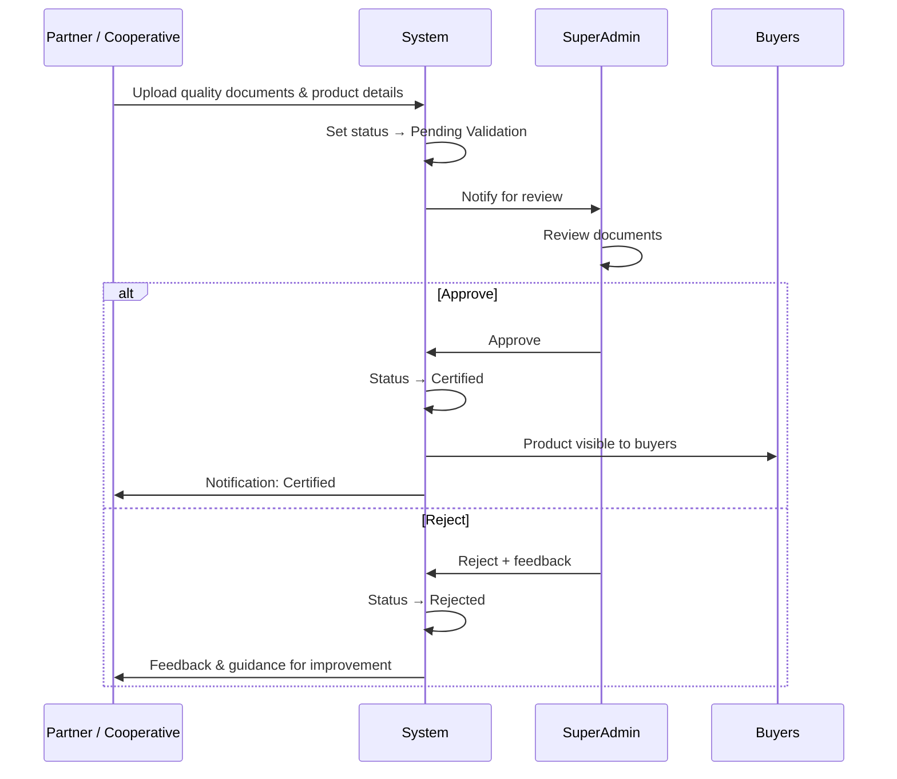
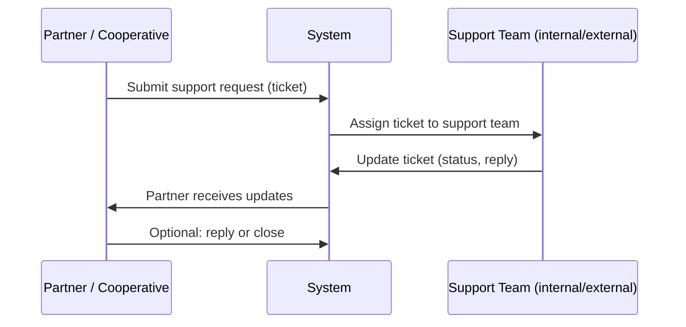
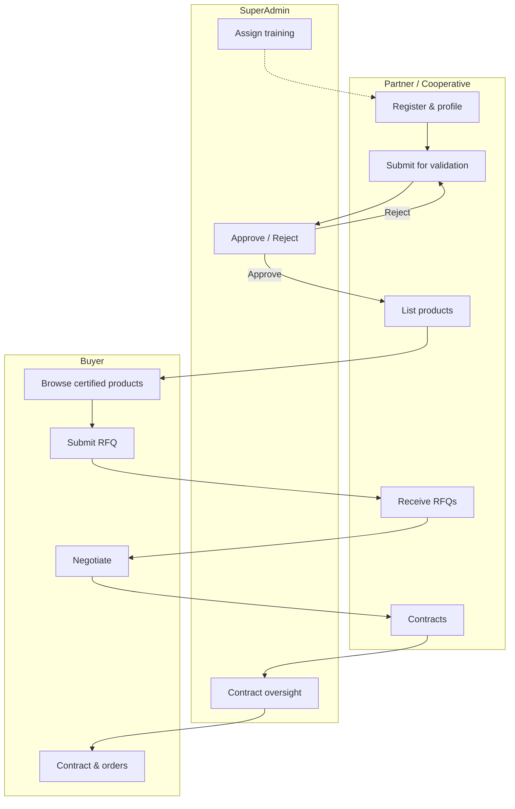

# OrigineMaroc — Workflow & Roles

> **Reality check (nevaliCosmetics repo):** Narrative still references **OrigineMaroc** as the product archetype. Implemented roles and routes use **nevaliCosmetics** naming (`superadmin`, `partner` under `/artisan`, `buyer` under `/buyer`). Treat workflow diagrams as intent, not a guarantee of every integration (e.g. payments remain off-platform / backlog).

**Plateforme Produits du Terroir** — Certified Moroccan products from verified cooperatives to global buyers.

---

## 1. Platform overview

OrigineMaroc is a two-sided B2B marketplace that connects **Moroccan producers and cooperatives** with **international buyers**. The platform is built around three value pillars:

| Value proposition | Description |
|-------------------|-------------|
| **Accès direct aux marchés internationaux** | Direct access to international markets for local producers. |
| **Contrats B2B et ventes premium** | B2B contracts and premium sales, with quality-audited, export-ready, traceable products. |

High-level actor flow:

---

## 2. Roles

### Role 1 — SuperAdmin

The **SuperAdmin** is the platform operator. They ensure quality, compliance, and smooth operations.

**Core features:**

| Area | Actions |
|------|--------|
| **User & Partner Management** | Create / edit / deactivate Partner accounts; assign roles & permissions; track partner activity and engagement. |
| **Quality & Certification Management** | Approve or reject uploaded certifications; track compliance and expiry dates. |
| **Analytics & Reporting** | Export dashboards (sales, compliance, quality metrics). |
| **Training & Programs Management** | Create training programs; assign programs to users/partners. |
| **B2B Contract Oversight** *(à vérifier)* | Approve contracts between partners and buyers; calculate platform commissions. |

---

### Role 2 — Partner / Cooperative

**Partners** are producers or cooperatives who register, get certified, list products, and receive RFQs/contracts from buyers.

**Core features:**

| Area | Actions |
|------|--------|
| **Company Profile & Verification** | Upload company documents; submit cooperative details (location, production capacity, certifications). |
| **Product Management** | Add / edit products; set MOQ, pricing, capacity; upload quality documents or images. |
| **Analytics & Reporting** | Export dashboards (sales, compliance, quality metrics). |
| **Certification & Quality Compliance** | Submit products for quality validation; track status (Pending / Approved / Rejected); receive feedback and guidance. |
| **Training Programs / Mise à Niveau** | Enroll in programs assigned by SuperAdmin. |

---

## 3. Validation workflow — Quality certification

This is the main flow for getting a product certified and visible to buyers.

**States:** `Pending Validation` → `Certified` (visible to buyers) or `Rejected` (partner receives feedback).

---

## 4. Technical & legal support workflow

How partners get help via support tickets.

---

## 5. End-to-end flow (simplified)

From partner registration to buyer contract.

---

## 6. File reference

Standalone Mermaid diagrams are in **`docs/workflow.mmd`** for use in other tools (Mermaid Live Editor, Confluence, etc.).

---

*Last updated from platform spec and role slides (SuperAdmin, Partner/Cooperative).*
